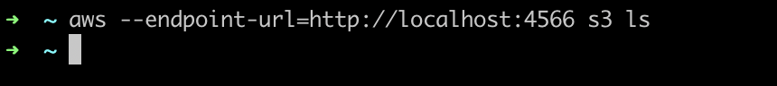
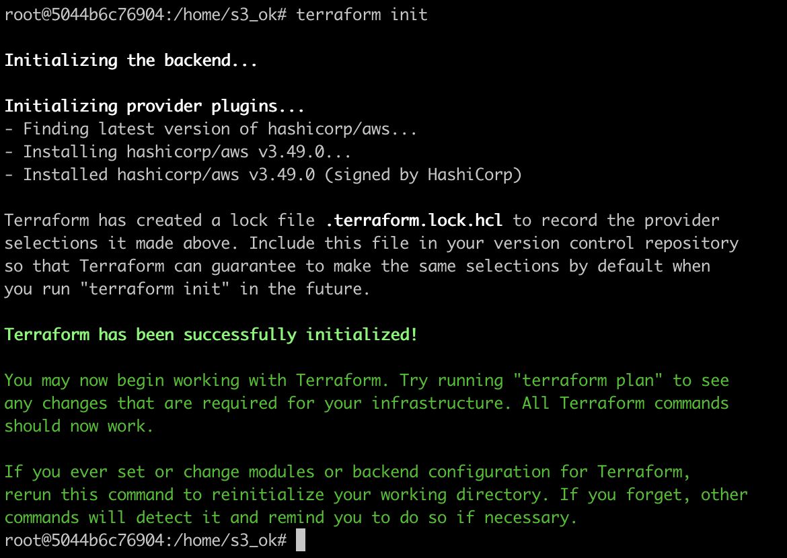
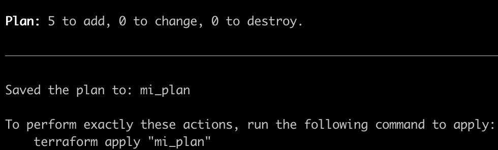
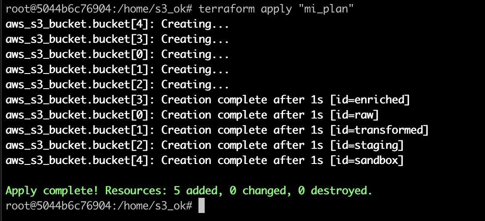
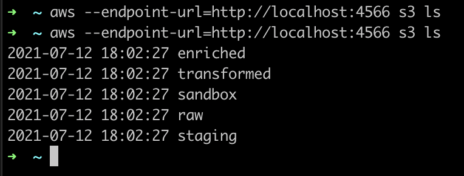
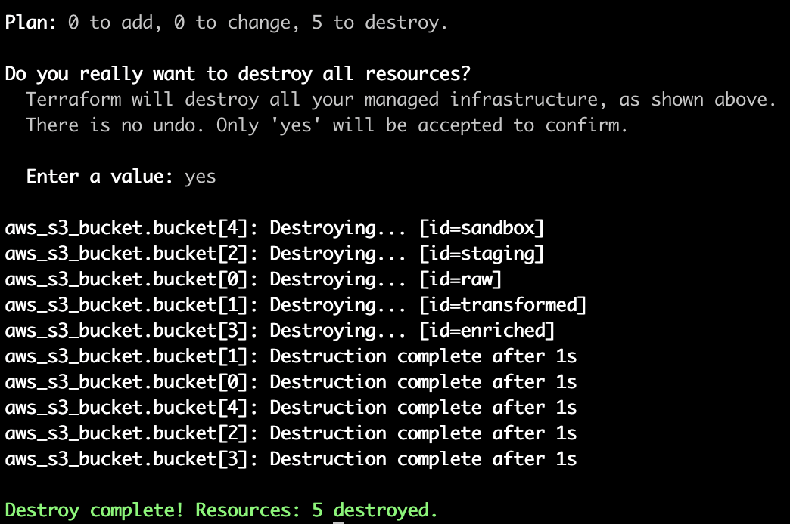
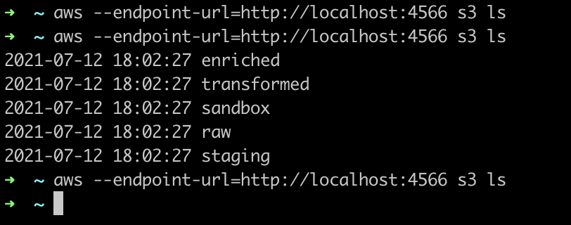
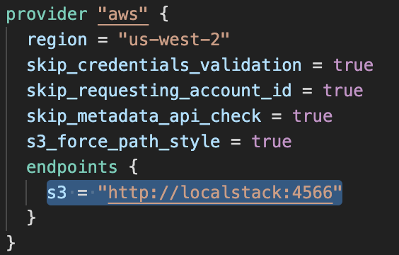
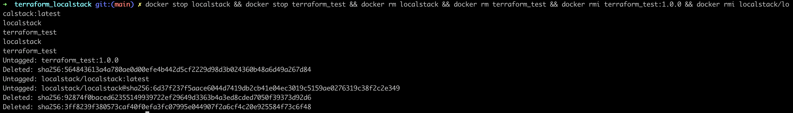

# Terraform & Localstack

## Iniciar los 2 containers y correr un exec sobre tf para trabajar ahi:

```docker-compose build --no-cache && docker-compose up -d --force-recreate && docker exec -it terraform_test /bin/bash```

La carpeta ```./tf``` esta seteada como volumen dentro del container en ```./home```


## Como trabajar?

La configuracion inicial setea credenciales "test" de AWS por lo que todo lo que se cree, planee, aplique y elimine va a ser en entorno local.
1) Abrir 2 pestañas en la consola, en una que quede el container exec donde se va a ejecutar el codigo de Terraform.
2) En la otra, usar la consola para consultar los servicios de AWS que estamos simulando. Localstack tarda un poco en iniciar asi que verificar mediante ```docker logs localstack``` que se vean los servicios activos
```Waiting for all LocalStack services to be read, Ready```
Luego ya se pueden tirar comando, ej (mismos comandos de cli + endpoint localstack)
```aws --endpoint-url=http://localhost:4566 s3 ls```



3) En la pestaña con el exec moverse a la carpeta /home, para tener uno de ejemplo deje la carpeta s3_ok ingresar y ejecutar los siguientes comandos de TF
    - ```terraform init``` (descarga los pluggins necesarios para que funcione el proveedor de AWS)



- ```terraform plan -out=mi_plan``` (crea un plan de ejecucion con el paso a paso y todas las cosas que va a crear. El -out se agrega para que cree un archivo con esas configuracion, de esta forma nos aseguramos que cada vez que apliquemos los cambios se ejecute siempre lo mismo)



- ```terraform apply "mi_plan"``` (Va a crear la infra configurada en el archivo main, en este caso, son 5 buckets con distintos tags, confgs, etc)



En este paso se puede ir a la otra solapa para volver a ejecutar ```aws --endpoint-url=http://localhost:4566 s3 ls``` y ver que los buckets estan creados. 



- ```terraform destroy``` (Al momento de hacer el apply se crean archivos con estados donde se guarda la info de lo que se creo, cambios, etc, el destroy lee ese archivo y destruye solo lo que ahi esta especificado. 
    

    
Luego del destroy pueden correr nuevamente ```aws --endpoint-url=http://localhost:4566 s3 ls``` para ver que ya los buckets desaparecieron)



# A tener en cuenta 

Si van a crear otros servicios es importante que seteen el endpoint al que tiene que ir Terraform.
En este caso como cree terraform_test y localstack como servicios dentro del mismo docker-compose puedo usar el nombre
del container como url



En el siguiente enlace se pueden ver los servicios que se pueden emular con localstack (Version Free):

```https://github.com/localstack/localstack```

En el siguiente enlace se pueden encontrar templates de Terraform:

```https://registry.terraform.io/```

## Salir de container tf:

```exit```

## Stop a containers:

```docker stop localstack && docker stop terraform_test```

## Start a containers:

```docker start localstack && docker start terraform_test && docker exec -it terraform_test /bin/bash```

## Eliminar todo:

1) Si los containers estan con estado STOP:

```docker rm localstack && docker rm terraform_test && docker rmi terraform_test:1.0.0 && docker rmi localstack/localstack:latest```

2) Si los containers estan con estado START:

```docker stop localstack && docker stop terraform_test && docker rm localstack && docker rm terraform_test && docker rmi terraform_test:1.0.0 && docker rmi localstack/localstack:latest```

